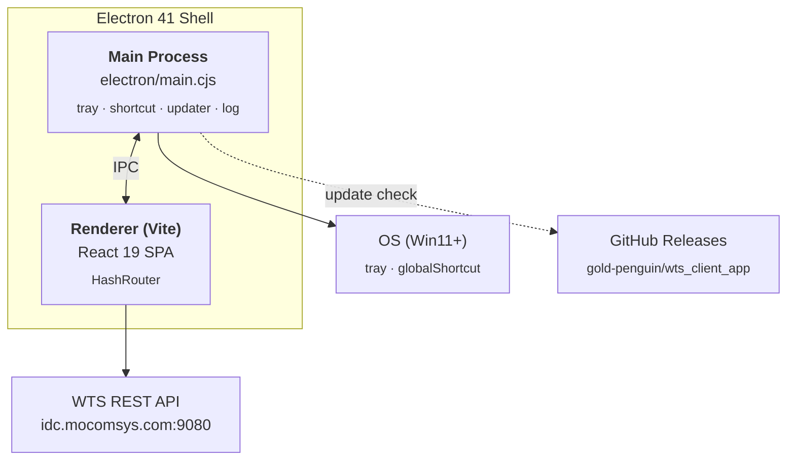
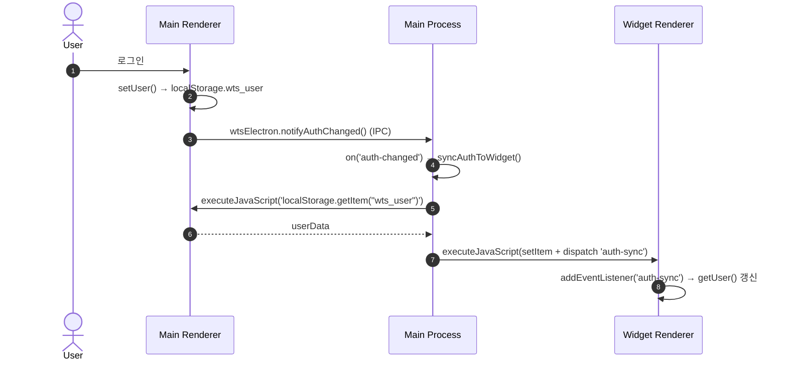
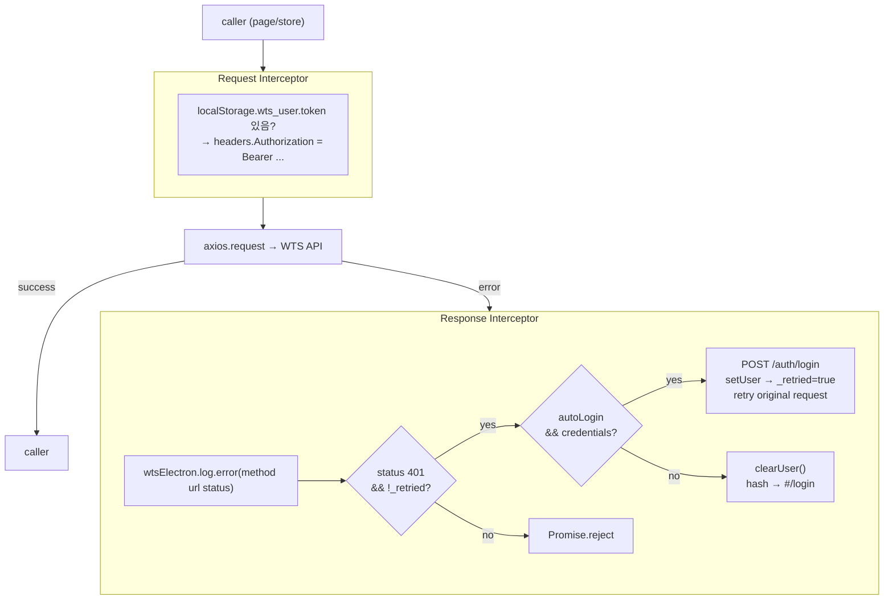
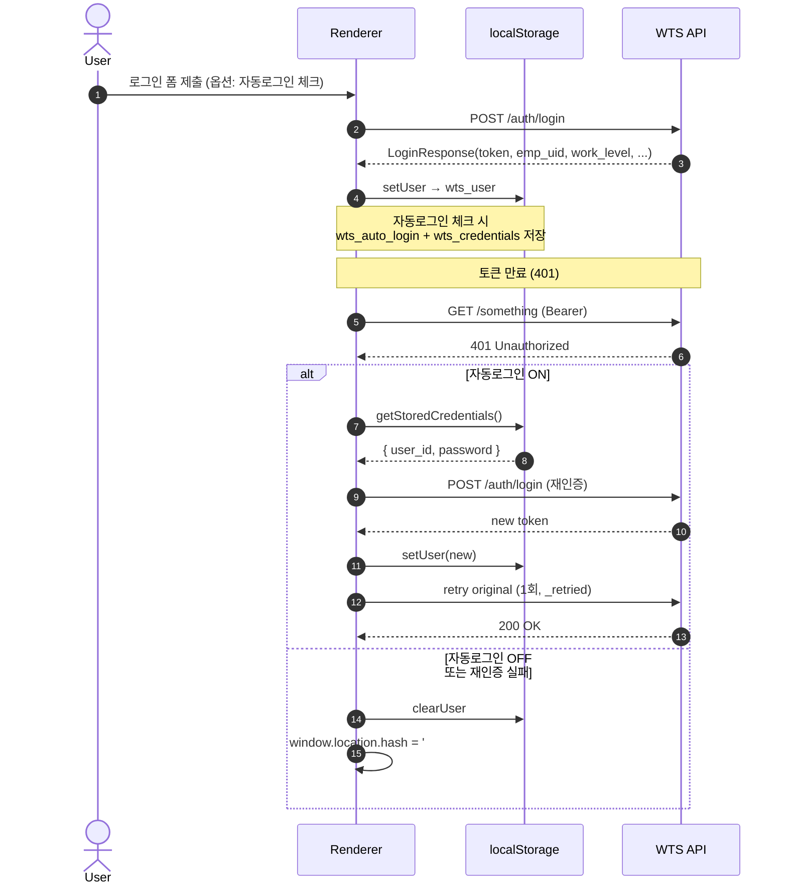
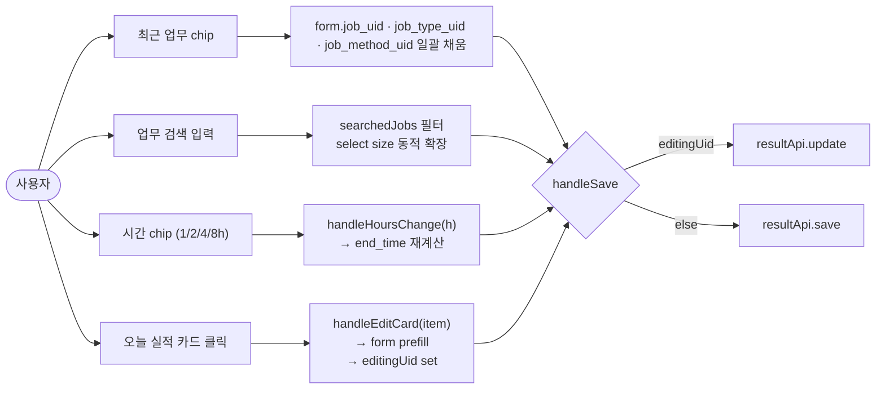
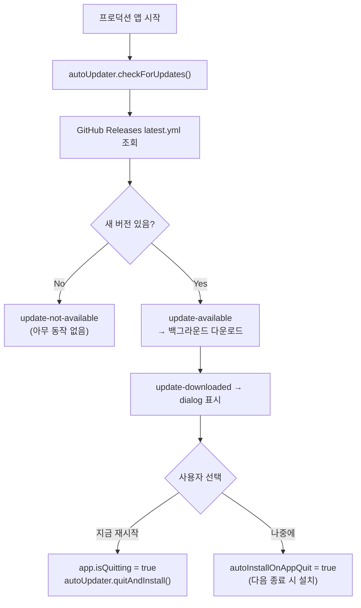

# Architecture

WTS 업무일지 클라이언트 (`wts-client`) — Mocomsys 사내 업무일지 시스템의 데스크톱 클라이언트.

---

## 1. High-level Stack



| Layer | Tech |
|---|---|
| 렌더러 UI | React 19, React Router 7 (HashRouter), Tailwind v4 |
| 빌드 | Vite 8 + `@vitejs/plugin-react` + `@tailwindcss/vite` |
| 데스크톱 셸 | Electron 41, `electron-builder` 26, `electron-updater` 6, `electron-log` 5 |
| HTTP | axios 1.x |
| 백엔드 | WTS Server (`http://idc.mocomsys.com:9080/api`, 외부 저장소) |

---

## 2. Process Architecture

### 2.1 Main Process — `electron/main.cjs`

단일 실행 인스턴스에서 두 개의 `BrowserWindow` 와 시스템 트레이를 관리.

| 객체 | 역할 |
|---|---|
| `mainWindow` | 1100×750 메인 SPA 창 — 닫기는 hide(true close는 `app.isQuitting`로만) |
| `widgetWindow` | 340×480 frameless, transparent, alwaysOnTop, skipTaskbar 위젯 — URL hash `/widget` |
| `tray` | 우클릭 메뉴(열기 / 위젯 / Always-on-top / 종료) + 더블클릭 메인 표시 |
| `globalShortcut` | `Ctrl+Shift+W` (메인 토글) / `Ctrl+Shift+D` (위젯 토글) |
| `autoUpdater` | `electron-updater` — 프로덕션 시작 시 GitHub Release 체크 → 다운로드 → dialog 후 quit-install |
| `log` | `electron-log` 파일 로테이션 (5MB), `console` 을 log 함수로 hook |

#### URL 라우팅 (`getUrl(hash)`)
- 개발: `http://localhost:5173/#${hash}`  (Vite dev server)
- 프로덕션: `file:///{__dirname}/../dist/index.html#${hash}`

#### Hash routes
| Hash | 컴포넌트 |
|---|---|
| `#/` | `MainLayout` + `ResultPage` |
| `#/widget` | `WidgetPage` (단독 렌더, `MainLayout` 미적용) |
| `#/login`, `#/jobs`, `#/weekly`, `#/customers`, `#/team`, `#/admin` | 해당 페이지 |

### 2.2 Preload — `electron/preload.cjs`

`contextIsolation: true` 환경에서 렌더러로 노출되는 IPC 브리지:

```js
window.wtsElectron = {
  notifyAuthChanged(): void,   // 로그인/로그아웃 시 위젯 동기화 트리거
  hideWidget(): void,           // 위젯 자체 종료(닫기 버튼)
  log: { error, warn, info },   // 메인 프로세스 파일 로그로 전달
}
```

### 2.3 Renderer

- **단일 SPA**가 두 창에서 동시에 렌더되며, `HashRouter` 의 hash 값으로 메인/위젯을 구분.
- `body.widget-mode` 클래스가 `WidgetPage` mount 시 추가되어 transparent 배경 적용 (`src/index.css`).

---

## 3. Cross-Window State Sync

위젯은 메인 창의 인증 상태를 **재사용** 해야 한다. 별도 IPC 메시지로 토큰을 보내지 않고, `localStorage` 를 단일 진실원천(SoT)으로 사용한다.



추가로 `toggleWidget()` 진입 시에도 `syncAuthToWidget()` 을 호출하여 항상 최신 상태로 표시.

| 키 (`localStorage`) | 의미 |
|---|---|
| `wts_user` | 로그인 응답 전체(JWT 포함) — `getUser()` / `isLoggedIn()` 의 원천 |
| `wts_auto_login` | `"true"` 면 자동 재로그인 활성 |
| `wts_credentials` | 자동 로그인용 `{ user_id, password }` |

---

## 4. HTTP / Auth Layer — `src/api/client.ts`

단일 axios 인스턴스에서 baseURL/인증/에러 로깅/재인증을 한 곳에 처리.



- **dev/prod baseURL 분기**: 렌더러가 `http(s):` 프로토콜에서 로드되면 (Vite dev) `/api` 프록시 사용, `file:` 에서 로드되면 직접 `http://idc.mocomsys.com:9080/api` 호출.
- Vite 프록시(`vite.config.ts`): `/api` → `http://idc.mocomsys.com:9080`

### API 모듈 분리 — `src/api/`

| 파일 | 책임 |
|---|---|
| `client.ts` | 인스턴스, 인증 헤더, 401 재인증, 에러 로깅 |
| `auth.ts` | `/auth/login` 등 |
| `result.ts` | 일/월/팀 실적, save/update/delete, recent, last-end-time, monthly-summary, calendar-detail |
| `job.ts` | 업무 마스터 |
| `dept.ts` | 부서 |
| `customer.ts` | 고객사 |
| `weekly.ts` | 주간 보고 (Fri-Thu) |
| `admin.ts` | 권한자 전용 |
| `common.ts` | jobTypes, jobMethods 등 코드성 데이터 |
| `search.ts` | 통합 검색 |

---

## 5. Auth & Auto-relogin Flow



`work_level >= 4` 인 사용자에게만 `/admin` 메뉴가 노출된다 (`MainLayout`).

---

## 6. Widget — `src/pages/WidgetPage.tsx`

### 6.1 컴포넌트 책임
- 오늘 등록 실적 목록 표시(`resultApi.day`) + 일일 합계 progress bar (목표 8h)
- 빠른 실적 등록 / 수정 (`resultApi.save` / `resultApi.update` / `resultApi.delete`)
- 최근 사용 업무 chip — `resultApi.recent(emp_uid, 20)` 결과를 `JOB_UID` 로 dedupe하여 상위 4개
- 시간 빠른 선택 chip (1h / 2h / 4h / 8h) + 직접 입력
- 업무 검색 — 클라이언트 측 substring 필터
- 메인 창과 인증 동기화 — `window.addEventListener('auth-sync' | 'focus')`

### 6.2 입력 폼 상호작용


### 6.3 시간 포맷 컨벤션
- API 응답: `'0900'` 또는 `'09:00'` (혼재 가능)
- form 내부: `'HH:MM'`
- API 전송: `'HHMM'` (`replace(':', '')`)
- `fmtTime(t)` helper가 `'0900'`/`'09:00'`/`number` 입력을 모두 처리

### 6.4 업무 범위(scope) → 유형 필터링
선택된 업무의 `JOB_SCOPE_CODE` 에 따라 유형 select 옵션을 제한 (예: `MA` scope → `MA`, `SM`, `MD` + `CO`).

---

## 7. Pages

| Page | 역할 |
|---|---|
| `LoginPage` | 로그인 폼, 자동 로그인 체크박스, `setUser` + `setAutoLogin` |
| `ResultPage` | 일자별 실적 입력/수정/삭제, 외근 모드, 최근 실적 |
| `JobPage` | 업무 마스터 등록·관리, 고객사·범위 매핑 |
| `WeeklyPage` | 주간 보고 — Fri-Thu 주간 컨벤션, `myJobs` 기반 |
| `CustomerPage` | 고객사 마스터 관리 |
| `TeamPage` | 팀원 월별 실적 캘린더 |
| `AdminPage` | `work_level >= 4` 전용 — 부서/사용자 관리 |
| `WidgetPage` | 트레이/단축키 위젯 (6절 참조) |

---

## 8. Build & Distribution

### 8.1 npm scripts
| Script | 용도 |
|---|---|
| `dev` | Vite dev server (5173) |
| `electron` | dev server + electron 동시 실행 |
| `build` | `tsc -b && vite build` (renderer만) |
| `build:electron` | `build` + `electron-builder` (Win portable + NSIS installer 생성, `release/`) |
| `lint` | ESLint |
| `docs:graph` | `dependency-cruiser` 분석 결과로 `docs/dependency-graph.md` 재생성 |
| `docs:graph:check` | 순환 의존성·고아 모듈 등 금지 규칙 검증 (CI 호환) |

### 8.2 electron-builder 설정 (package.json `build`)
- `appId`: `com.mocomsys.wts`
- `productName`: `WTS 업무일지`
- `win.target`: `portable`, `nsis`
- `files`: `dist/**/*`, `electron/**/*`
- `publish`: GitHub provider — `gold-penguin/wts_client_app`
- output: `release/`

### 8.3 CI — `.github/workflows/`
- **ci.yml** — push/PR 시 `tsc -b --noEmit` + ESLint + `npm run build` (ubuntu)
- **version.yml** — main 푸시 → 커밋 메시지 기반 SemVer bump → 태그 push → windows-latest 에서 패키징 → `softprops/action-gh-release` 로 Release 생성·아티팩트 업로드
  - `chore:` 커밋은 자동 bump를 건너뜀 (무한 루프 방지)
- **build.yml** — `workflow_dispatch` 수동 빌드 전용

### 8.4 Auto-update 흐름


---

## 9. Versioning

`docs/RELEASE_NOTES.md` 의 "Versioning Convention" 절 참조. Conventional Commits → 자동 SemVer.

| Prefix | Bump |
|---|---|
| `BREAKING CHANGE` | major |
| `feat:` | minor |
| `fix:` | patch |
| 그 외(`chore:`, `docs:`, ...) | 없음 |

---

## 10. 디렉터리 구조

```
WTS_Client/
├─ electron/            # 메인 프로세스 + preload + 아이콘
│  ├─ main.cjs
│  ├─ preload.cjs
│  └─ icon.{ico,png}
├─ src/
│  ├─ api/              # axios 인스턴스 + 엔드포인트 모듈
│  ├─ assets/
│  ├─ components/       # (현재 비어있음 — 페이지 내부 로컬 컴포넌트 사용)
│  ├─ hooks/
│  ├─ layouts/
│  │  └─ MainLayout.tsx
│  ├─ pages/            # 라우트 단위 페이지
│  ├─ stores/
│  │  └─ authStore.ts   # localStorage 래퍼 + electron 알림
│  ├─ types/            # 도메인 타입(LoginResponse, ResultSaveRequest, ...)
│  ├─ App.tsx           # HashRouter + ProtectedRoute
│  ├─ index.css         # Tailwind import + 위젯 전용 클래스
│  └─ main.tsx
├─ docs/
│  ├─ ARCHITECTURE.md       # 이 문서
│  ├─ RELEASE_NOTES.md
│  └─ dependency-graph.md   # `npm run docs:graph` 로 자동 생성
├─ scripts/
│  └─ generate-graph.cjs    # depcruise → docs/dependency-graph.md
├─ .dependency-cruiser.cjs  # depcruise 설정 (forbidden 규칙 포함)
├─ .github/workflows/
│  ├─ ci.yml
│  ├─ version.yml
│  └─ build.yml
├─ release/             # electron-builder 출력 (git-ignored)
├─ dist/                # vite 출력 (git-ignored)
├─ package.json
├─ vite.config.ts
└─ tsconfig*.json
```

---

## 11. 주요 외부 의존성 / 경계

| 의존 | 통신 방식 | 인증 |
|---|---|---|
| WTS API (`idc.mocomsys.com:9080`) | REST + JSON | `Authorization: Bearer <token>` |
| GitHub Releases | electron-updater HTTPS | public (anonymous) |

**보안 메모**
- 자동 로그인 자격증명은 localStorage 평문 저장 — 공용 PC 사용 시 주의 (현재 OS-level 암호화는 적용되어 있지 않음).
- Electron `nodeIntegration: false`, `contextIsolation: true` — 권장 보안 기본값 준수.

---

## 12. Living Documentation — 의존성 그래프

이 문서의 다이어그램들은 손으로 그렸기 때문에 코드와 어긋날 위험이 있다. 그래서 모듈 간 import 그래프는 `dependency-cruiser` 로 **실제 소스에서 추출** 한다.

- **그래프 위치**: [`docs/dependency-graph.md`](./dependency-graph.md)
- **재생성**: `npm run docs:graph` — `src/` 전체를 스캔해 Mermaid `flowchart LR` 로 출력
- **검증**: `npm run docs:graph:check` — `.dependency-cruiser.cjs` 의 `forbidden` 규칙(순환 의존성·고아 모듈)을 위반하면 비-0 종료. CI에 추가하면 검증 가능.
- **설정**: `.dependency-cruiser.cjs` — `tsConfig: tsconfig.app.json` 기반, `node_modules` 제외, `src/` 만 포함.

PR 리뷰 시 import 구조 변경이 있으면 `npm run docs:graph` 를 돌려 그래프 파일도 같이 커밋하는 것을 권장한다.
