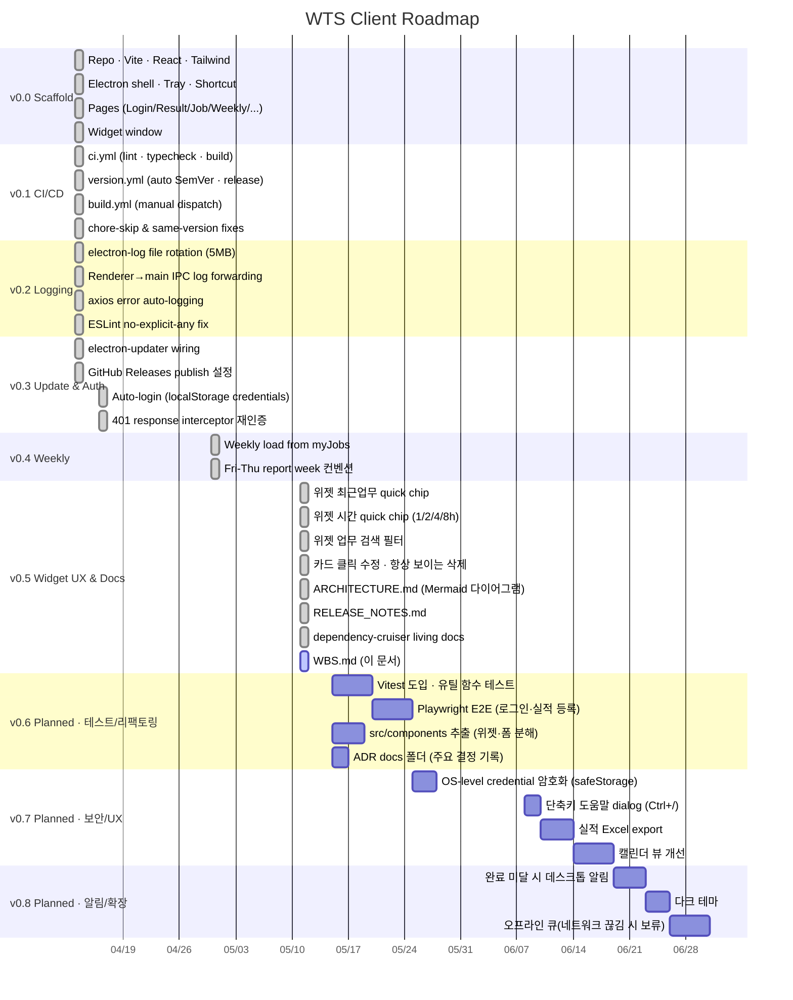

# WTS Client — Work Breakdown Structure

WTS 업무일지 데스크톱 클라이언트의 전체 작업 분해. 완료 작업은 git 커밋·태그 기준 실제 날짜, 예정 작업은 잠정 일정.

---

## Milestone Overview

| Version | 날짜 | 핵심 작업 | 상태 |
|---|---|---|---|
| v0.0 (init) | 2026-04-13 | React+Vite+Electron 스캐폴드, 페이지 8개 | ✅ |
| v0.1.0 | 2026-04-13 | CI/CD 파이프라인, 자동 SemVer | ✅ |
| v0.2.0/.1 | 2026-04-13 | electron-log 프로덕션 로깅 | ✅ |
| v0.3.0 | 2026-04-16 | Auto-update + Auto-login(401 재인증) | ✅ |
| v0.4.0 | 2026-04-30 | 주간 보고 Fri-Thu 컨벤션 | ✅ |
| v0.5.0 (작업 중) | 2026-05-11 | 위젯 UX 개편, 아키텍처 문서화 | 🚧 |
| v0.6.0 (예정) | ~2026-05 | 테스트 인프라, 컴포넌트 추출 | 📋 |
| v0.7.0 (예정) | ~2026-06 | 보안 강화, UX 개선 | 📋 |

---

## Gantt Chart

---

## 작업 분해 (계층)

### 1. Infrastructure & Tooling
- 1.1 빌드 시스템 — Vite + TypeScript + Tailwind v4
- 1.2 Electron 셸 — main · preload · tray · shortcut
- 1.3 CI/CD — `.github/workflows/{ci,version,build}.yml`
- 1.4 자동 버전 관리 — Conventional Commits → SemVer
- 1.5 자동 업데이트 — electron-updater + GitHub Releases
- 1.6 로깅 — electron-log + IPC 통합

### 2. Authentication
- 2.1 로그인 폼 (`LoginPage`)
- 2.2 JWT Bearer 토큰 자동 첨부 (`api/client.ts` request interceptor)
- 2.3 자동 로그인 옵션 (localStorage credentials)
- 2.4 401 응답 자동 재인증 (response interceptor, 1회 retry)
- 2.5 보호된 라우트 (`ProtectedRoute` in `App.tsx`)

### 3. Core Features
- 3.1 실적 입력 (`ResultPage`) — CRUD, 외근 모드, 최근 실적
- 3.2 업무 관리 (`JobPage`) — 마스터 등록, 고객사·범위 매핑
- 3.3 주간 보고 (`WeeklyPage`) — Fri-Thu 컨벤션, myJobs 기반
- 3.4 고객사 관리 (`CustomerPage`)
- 3.5 팀 현황 (`TeamPage`) — 월별 캘린더
- 3.6 관리자 (`AdminPage`) — `work_level >= 4` 전용

### 4. Widget
- 4.1 별도 윈도우 (frameless · transparent · alwaysOnTop)
- 4.2 메인↔위젯 인증 동기화 (localStorage SoT + IPC)
- 4.3 빠른 실적 입력 (recent chips · hour chips · 검색)
- 4.4 카드 클릭 수정 · 삭제
- 4.5 일일 진행률 progress bar

### 5. Documentation
- 5.1 `ARCHITECTURE.md` — 12개 절, Mermaid 다이어그램 6개
- 5.2 `RELEASE_NOTES.md` — 버전별 변경 이력
- 5.3 `dependency-graph.md` — depcruise 자동 생성
- 5.4 `WBS.md` — 이 문서
- 5.5 (예정) `docs/adr/` — 주요 아키텍처 결정 기록

### 6. (예정) Quality
- 6.1 Vitest 단위 테스트 — `fmtTime`, scope→type 필터, 시간 계산
- 6.2 Playwright E2E — 로그인 → 실적 등록 → 위젯 → 로그아웃
- 6.3 컴포넌트 추출 — 현재 `src/components/` 비어있음, 위젯/폼 분해
- 6.4 dependency-cruiser CI 통합 — `docs:graph:check` 를 ci.yml 에 추가

### 7. (예정) Security & UX
- 7.1 자격증명 OS 암호화 — Electron `safeStorage` 로 이전
- 7.3 단축키 도움말 dialog
- 7.4 실적 Excel export
- 7.5 캘린더 뷰 개선 (드래그·드롭으로 시간 재배치)
- 7.6 다크 테마

### 8. (예정) Notifications & Offline
- 8.1 데스크톱 알림 — 일일 목표 미달 시
- 8.2 오프라인 큐 — 네트워크 끊김 시 실적 보류·재전송

---

## 범례

| 상태 | 의미 |
|---|---|
| ✅ `done` | 커밋/태그로 확정된 완료 작업 |
| 🚧 `active` | 현재 작업 중 (v0.5.0 미릴리즈) |
| 📋 plan | 잠정 일정 — 우선순위·범위 조정 가능 |

> 예정(v0.6+) 항목의 날짜는 placeholder입니다. 백로그 우선순위가 정해지면 본 문서를 갱신하세요.
