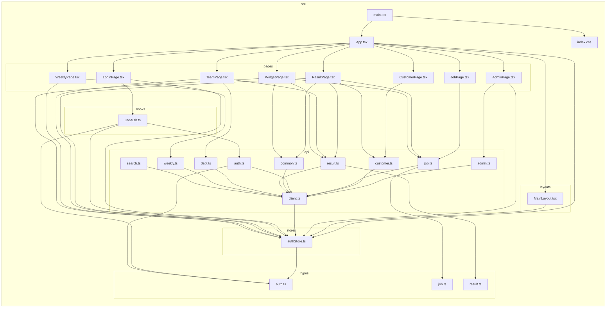

# Dependency Graph

`dependency-cruiser` 가 실제 import 그래프를 분석해 자동 생성한 다이어그램입니다.

**재생성**: `npm run docs:graph`

> ⚠️ 이 파일은 자동 생성됩니다. 수동 편집하지 마세요 — `npm run docs:graph` 가 덮어씁니다.

## src 모듈 의존성

```mermaid
flowchart LR

subgraph 0["src"]
1["App.tsx"]
subgraph 2["layouts"]
3["MainLayout.tsx"]
end
subgraph 4["stores"]
5["authStore.ts"]
end
subgraph 6["types"]
7["auth.ts"]
H["job.ts"]
P["result.ts"]
end
subgraph 8["pages"]
9["AdminPage.tsx"]
D["CustomerPage.tsx"]
F["JobPage.tsx"]
I["LoginPage.tsx"]
M["ResultPage.tsx"]
Q["TeamPage.tsx"]
S["WeeklyPage.tsx"]
U["WidgetPage.tsx"]
end
subgraph A["api"]
B["admin.ts"]
C["client.ts"]
E["customer.ts"]
G["job.ts"]
L["auth.ts"]
N["common.ts"]
O["result.ts"]
R["dept.ts"]
T["weekly.ts"]
V["search.ts"]
end
subgraph J["hooks"]
K["useAuth.ts"]
end
W["main.tsx"]
X["index.css"]
end
1-->3
1-->9
1-->D
1-->F
1-->I
1-->M
1-->Q
1-->S
1-->U
1-->5
3-->5
5-->7
9-->B
9-->5
B-->C
C-->5
D-->E
E-->C
F-->G
G-->H
G-->C
I-->K
I-->5
K-->L
K-->5
K-->7
L-->7
L-->C
M-->N
M-->E
M-->G
M-->O
M-->5
N-->C
O-->P
O-->C
Q-->R
Q-->O
Q-->5
R-->C
S-->T
S-->5
T-->C
U-->N
U-->G
U-->O
U-->5
V-->C
W-->1
W-->X
```
